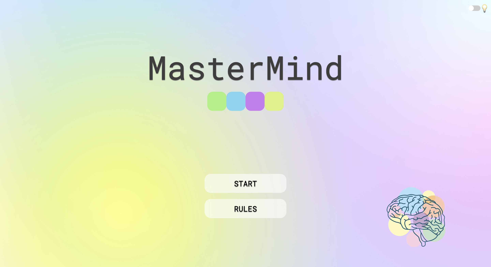
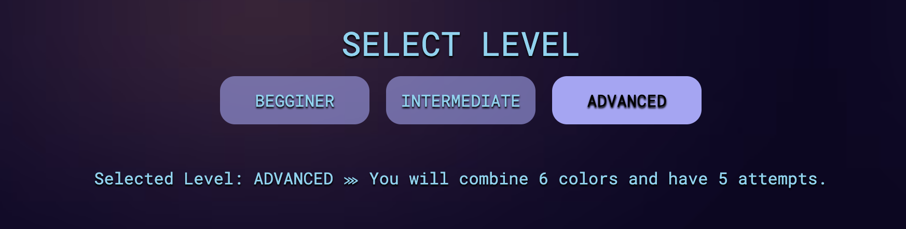
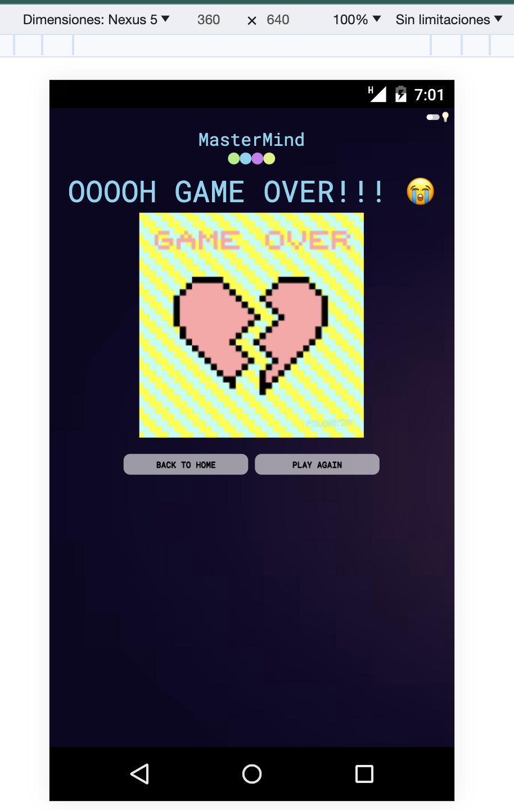

---

# Mastermind Game
🧠 [Mastermind Game](https://ladronbx.github.io/mastermind/) 🧠

**Third project of the Full Stack Developer Bootcamp at GeeksHubs Academy, Valencia**

During this project, I have applied the knowledge acquired during the third and fourth weeks of the Bootcamp to create a web page that represents the **Mastermind** game.

---

## Table of Contents

- 🛠️ [Technologies Used](#technologies-used)
- 📋 [Usage Instructions](#usage-instructions)
- 🏠 [Home](#home)
- ❓ [Rules](#rules)
- 🚀 [Start](#start)
- 🏳️‍🌈 [Select your colours](#select-your-colours)
- ⚙️ [Game Board](#game-board)
- 👎🏽 [Game Over](#game-over)
- 🏆 [Victory](#victory)
- 📱 [Media Query](#media-query)
- 🧩 [Source Code](#source-code)
- 🔝 [Improvements](#improvements-i-would-have-liked-to-integrate)
- 🤝 [Contributions](#contributions)
- 📧 [Contact](#contact)
- 🌐 [GitHub Pages Link](#github-pages-link)

## Technologies Used:

  

## Usage Instructions

To see the project in action, you can access the online web page by visiting the following link: 🧠 [Mastermind Game](https://ladronbx.github.io/mastermind/) 🧠

If you want to run the project locally, follow these steps:

1. Download all the folders and files from the repository.
2. Open the `index.html` file in your web browser.

## Home

This HTML represents the main page of the project. The user will have two options:
  - Start the game by clicking on **START**
  - Read the **RULES** of the game

The user will also have the option to switch between dark and light modes. In the upper right corner, the user can see a switch to toggle between dark and light modes.

  

    
 

## Rules

In Mastermind, your goal is to guess the correct combination of colors. There are three difficulty levels:
##### ⋙ Beginner: You will play with 4 possible colors and have 5 attempts.

  

##### ⋙ Intermediate: You will choose from 5 colors and have 5 attempts.

  

##### ⋙ Advanced: You will combine 6 colors and have 5 attempts.

  

Using the available colors, you must create different combinations until you discover the correct solution. After each attempt, you can check your guess. The game will show you how many colors you've correctly placed (marked with purple balls) and how many colors you've guessed right but placed in the wrong spot (marked with white balls). Good luck!

## START

If the user clicks **START** on the main page, they will need to enter their name and select the difficulty level before starting the game.

   

## SELECT YOUR COLOURS

After entering their name and selecting the colors, color containers will be dynamically generated. 
If the user selects **Beginner**, 4 containers will be displayed.
If the user selects **Intermediate**, 5 containers will be displayed.
If the user selects **Advanced**, 6 containers will be displayed.

   

Once the user has selected their favorite colors using the color picker, they can proceed to play the game.

## GAME BOARD

The game board consists of 3 containers. 
On the far left, the user is informed about the attempts they have remaining.

  

In the middle, users can see the containers where they can choose their color combination.

On the right, there are check balls. Blue indicates that the color is correct but not in the correct position, while black means the color is in the correct position.

In this case, the green color is the only one in the correct position.

## Game Over

This page appears automatically if the user has lost and run out of attempts.

  

## Victory

This page appears automatically if the user has won.

  

## **Media Query**

This project uses media queries to ensure that the webpage looks and functions correctly on different screen sizes. The following modifications are applied for screens with a maximum width of 990px, 750px, and 680px:

- For screens with a maximum width of 990px, the font size is adjusted to 0.7em to improve readability on smaller devices.

- When the screen has a maximum width of 750px, the font size is further reduced to 0.5em to adapt to mobile devices and tablets.

- For screens with a maximum width of 680px, a font size of 0.33em is applied to maintain an appealing design on smaller mobile devices.

In addition to these font size adjustments, please note that the CSS also controls hidden horizontal overflow (overflow-x: hidden) and automatic vertical overflow (overflow-y: auto) on the HTML element for a smooth user experience.

  

## Source Code

The source code of this project can be found in the GitHub repository [Mastermind Game](https://github.com/ladronbx/mastermind.git). Below is a brief description of the project's structure:

- **index.html**: This HTML file is the main page of the web application and contains the overall structure of the page, including the HTML elements that make up the game.

- **css/**: In this folder, you'll find the CSS files used to style the page. They are organized into separate files for ease of style management and maintenance.

- **js/**: In this folder, you'll find the JavaScript files used for page interactivity. You can find functions and events that make the game work.

- **img/**: This folder contains images and resources used on the web page and other visual elements.

- **README.md**: The README.md file contains the information you are currently reading, providing an overview of the project, usage instructions, and other important details.

This project has been developed using standard web technologies like HTML, CSS, and JavaScript to create an interactive and engaging user experience.

---

## Improvements I Would Have Liked to Integrate

I would have liked to integrate a dynamic mode, allowing users to choose the number of colors to play with and the number of available attempts.

---

## Contributions

This project is public, and contributions are welcome. If you'd like to contribute, follow these steps:

1. Fork the repository.
2. Create a new branch for your contribution.
3. Make your changes and improvements.
4. Submit a pull request for review and merging.

---

## Contact

If you have any questions, comments, or suggestions, feel free to contact me at [ladronbravovlc@gmail.com](mailto:ladronbravovlc@gmail.com).

---

## GitHub Pages Link

- 🧠 [Mastermind Game](https://ladronbx.github.io/mastermind/) 🧠

---
